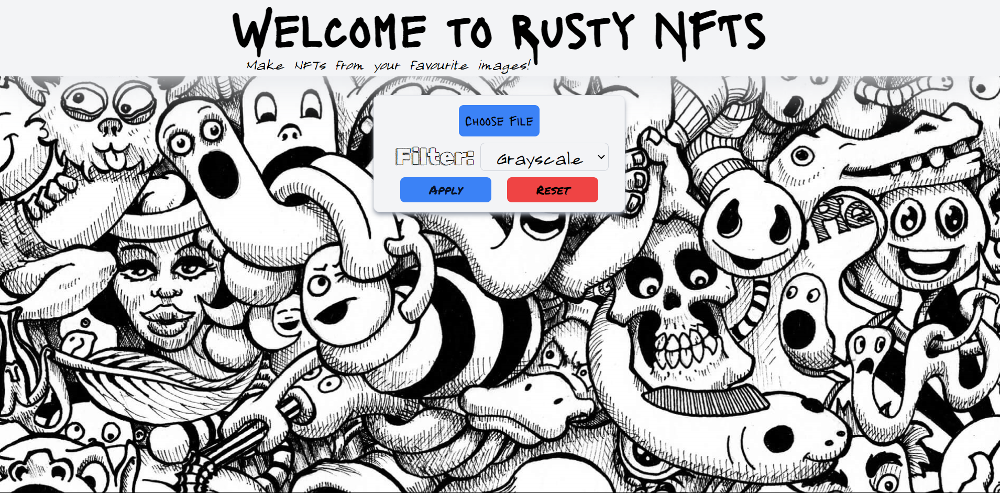
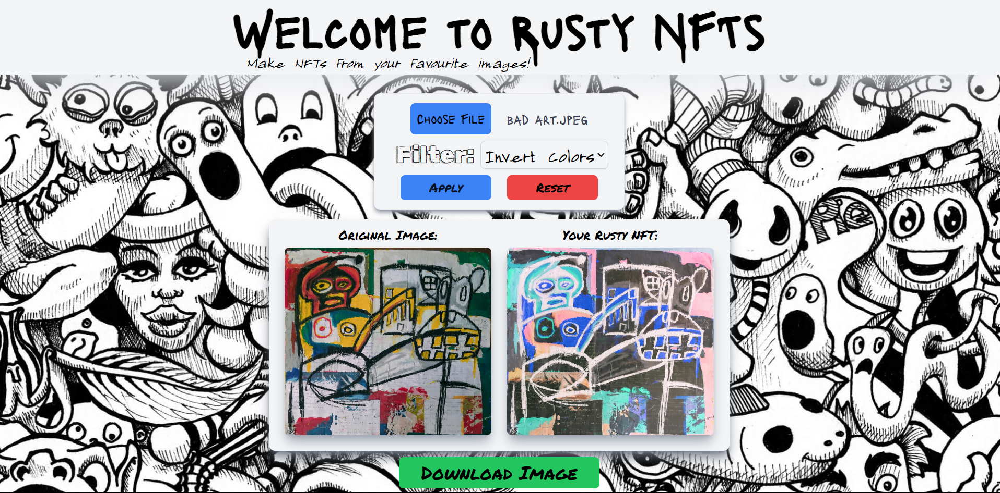
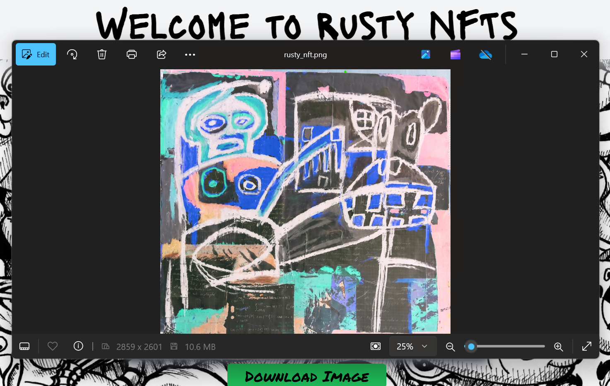

# Rusty NFTs


## Project Overview:

Rusty NFTs is a web-based (satirical) application that empowers users to transform their images into unique digital artworks by applying a variety of customizable filters. Leveraging the power of Rust and WebAssembly, this project offers near-native performance for complex image processing tasks, all within the browser.

This application allows users to:

   - Upload their images through a user-friendly interface.
   - Apply a range of filters including Sepia, Emboss, Posterize, and more, directly in the browser.
   - Download the transformed images as ready-to-mint NFTs!

With a seamless integration of React for the frontend and Rust for the backend processing, Rusty NFTs provides an efficient and engaging way to create and experiment with filters and digital images. 

## Welcome to Rusty NFTs!


## Apply a range of filters!


## Create your own NFTs!


## Technologies Used

- **Frontend Framework**: React with TypeScript
- **Styling**: Tailwind CSS
- **WebAssembly**: Rust compiled to WebAssembly for image processing
- **Image Processing**: Rust's `image` crate

## Highlights

- **Rust & WebAssembly**: This project integrates Rust with WebAssembly, allowing for high-performance image processing directly in the browser.
- **TypeScript**: Ensured type safety and improved code maintainability by using TypeScript.
- **Tailwind CSS**: Continued use of Tailwind CSS for rapid, responsive design.
- **Custom Filters**: Implemented custom image filters like Sepia, Emboss, and Posterize in Rust.

## Build Steps

1. **Clone the repository**:
   ```bash
   git clone https://github.com/TimBroderick44/Rusty_NFTs.git
   cd Rusty-NFTS/rusty_nfts_react
   ```
2. **Install dependencies**:
   ```bash
   npm install
   ```
3. **Build the WebAssembly package**:
   ```bash
   cd ..
   cd rusty_nfts_rust
   wasm-pack build --target web
   ```
4. **Copy the WebAssembly package to the React folder**:
   ```bash
   cp pkg/* ../rusty_nfts_react/public/pkg
   ```
5. **Start the development server**:
   ```bash
    cd ..
    cd rusty_nfts_react
    npm run dev
    ```
6. **Enjoy!**

## Lessons Learnt:

### Rust & WebAssembly:
This project was my first deep dive into using Rust with WebAssembly. The ability to perform intensive image processing directly in the browser with near-native performance was eye-opening. I’m excited to explore more use cases for WebAssembly in future projects.

### Tailwind CSS:
Tailwind CSS remains a staple in my projects for its ability to streamline the styling process and produce clean, responsive designs quickly.

### Image Processing in Rust:
Learning how to use the `image` crate for processing and transforming images in Rust was a rewarding challenge. I now have a deeper understanding of image manipulation techniques and their implementation.

## What I still need to do:

### Additional Features:
- [ ] Implement additional filters.
- [ ] Add drag-and-drop support for image uploads.
- [ ] Create a more dynamic user interface for filter adjustments.

## Thank You!

Thank you for taking the time to explore this project. I hope you enjoy experimenting with the filters.  
Feel free to reach out and ask any questions.

[Tim Broderick]